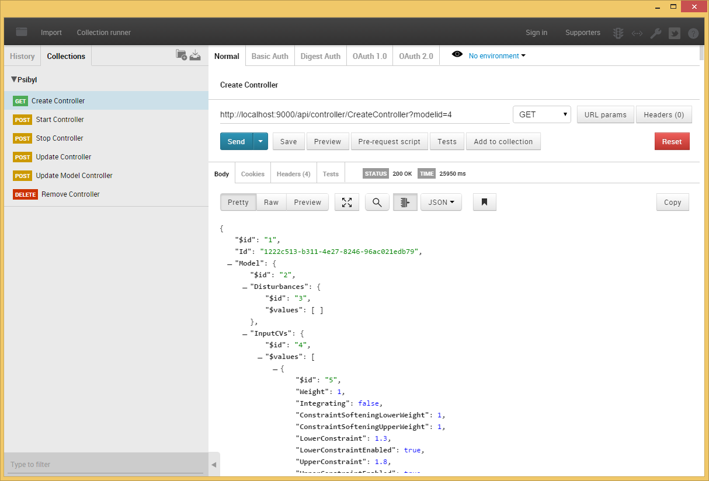
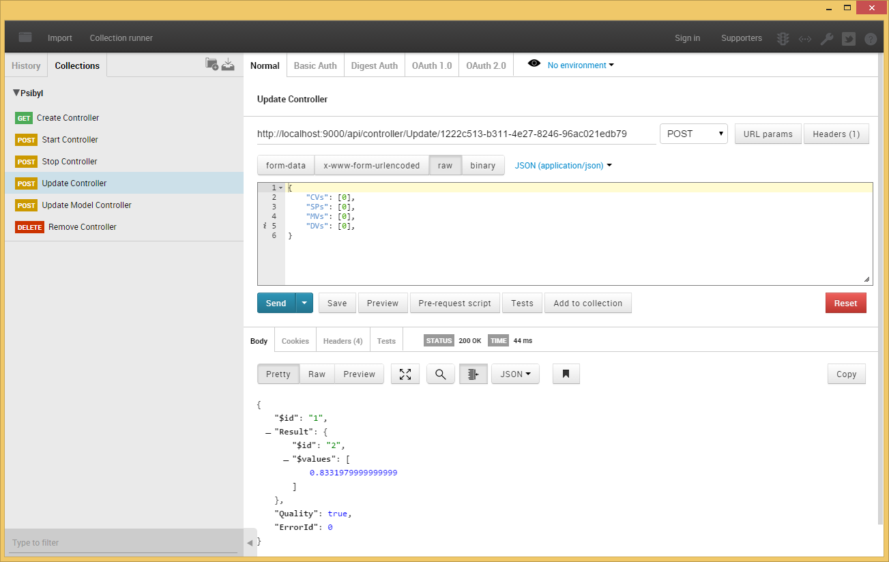

##Psibyl Integration (REST/Web API)

You can facilitate the control of a Psibyl controller using a RESTful Web API. This is the simplest and easiest way to integrate Psibyl with control platforms that are not based on the .Net Framework.


[TOC]


##Overview

At the core of Psibyl is a Web server which provides access to and storage of all MPC models. Any interaction with Psibyl requires that the Psibyl Server is running. Typically, control is done using a .Net library, provided with Psibyl, which is integrated directly into the control/execution platform (see Psibyl Controller Integration (.Net)). The Psibyl server hosts and provides access to this same API over a simple REST interface. Since any interprocess communication, from a non .Net process to a .Net process, is likely to be done with a TCP/IP protocol, it may be desirable to interact directly with the web server over TCP/IP and HTTP rather than having to write an additional interface. The following sections describe how to acheive this.


#Create a Controller

The following URL demonstrates how to create a controller hosted on the Psibyl Server.


GET -


`http://localhost:9000/api/controller/createcontroller?modelid={modelid}`


The URL requires only the {modelid} which is an integer, identifying the model which will be used to create the controller. The following shows an example. 


GET -


`http://localhost:9000/api/controller/createcontroller?modelid=1`


When the request is completed you should receive a response containing something similar to the following JSON. Take note of the "Id" field. You will need this for all subsequent requests.


```

{

  "$id":"1",

  "Id":"302f5555-24fd-4d66-8335-2ae58c9b2119",

  "Model":

  {

    ... 

  },

  "ExecutionState":0,

  "Lookup":null,

  "CVConstraintStrategy":1,

  "QPSolver":null,

  "QPMaxIterations":50,

  "QPTollerance":0.0001,

  "PredictedCVsOL":null,

  "PredictedCVsCL":null,

  "ModelId":1,

  "CurrentDiagnosticIteration":null

}

```


##Managing a Controller

Once a controller has been created and you have the controller id, you can use the id to start and stop the controller. 

To start the controller, use the following URL. This will initialize the controller, making it ready for execution. 


POST -


`http://localhost:9000/api/controller/Start/302f5555-24fd-4d66-8335-2ae58c9b2119`


To stop the controller you can use the following URL. Once the controller has been stopped you will no longer be able to execute it. 


POST -


`http://localhost:9000/api/controller/Stop/302f5555-24fd-4d66-8335-2ae58c9b2119`


Both requests will return a 'true' if the request succeeded. 

If the request failed due to an incorrect controller id, you will receive the following error response.


```

{

  "Id":0,

  "Message":"An error occured",

  "ExceptionMessage":"Unable to find a controller for given Id '1492b7b4-fcb7-40e0-9a83-bb5caf39318d' - Correlation Id: 1eb4db28-0376-4528-8532-eb72f8ae6e2f",

  "ExceptionType":"Psibyl.Service.CorrelationException",

  "StackTrace":null

}

```


When a controller has been stopped, you may wish to remove it from the server. You can do this with the following URL. 


DELETE -


`http://localhost:9000/api/controller/delete/302f5555-24fd-4d66-8335-2ae58c9b2119`


##Executing a controller

Once a controller is started you may execute it by using the Execute request. This must be down at each execution interval and the current values must be provided. Also, as most REST clients execute asynchronously, you must make sure that you have received a response for the current iteration before sending the Execute request again. I.e. executes should be synchronous. The following is the URL used to perform an execution of the controller. 


POST -


`http://localhost:9000/api/controller/Execute/302f5555-24fd-4d66-8335-2ae58c9b2119`


The following JSON must also be provided with this request. This describes the current values to give to the controller for a 1 x 1 model with no disturbances.


```

{

  "CVs":[0],

  "SPs":[0],

  "MVs":[0],

  "DVs":[]

}

```


The following is an example of a current values for a 2 x 2 model with 1 disturbace.


```

{

  "CVs":[1,2],

  "SPs":[3,4],

  "MVs":[3,4],

  "DVs":[1]

}

```


The response you will recieve from an Execute request will look as follows.


```

{

  "$id":"1",

  "Result":

  {

    "$id":"2",

    "$values":[0.8331979999999999]

  },

  "Quality":true,

  "ErrorId":0

}

```


##Updating a Controller's Model

In order to update the model of a controller, for example, changing weights, constraints and limits. You may use the UpdateModel request. The URL looks as follows. 


POST -


`http://localhost:9000/api/controller/UpdateModel/302f5555-24fd-4d66-8335-2ae58c9b2119`


You must provide the entire model in JSON to the request. This is best achieved by retrieving the model and then modifying the desired parameters. 

The following URL demonstrates how to retrieve an MPC model. 


GET -


`http://localhost:9000/api/mpcmodel/Get/1`


The response, which has been shortened for display purposes, should look as follows.


```

{

  "$id":"1",

  "Disturbances":

  {

    "$id":"2",

    "$values":[] 

  },

  "InputCVs":

  {

    ...

  },

  "OutputMVs":

  {

    ...

  },

  "Id":1,

  "Name": "Demo Model",

  "LastUpdated":"\/Date(1427714090680+0200)\/",

  "ModelExecutionState":0,

  "PredictionHorizon":118,

  "ControlHorizon":36,

  "ModelHorizon":118,

  "SampleInterval":5,

  "ConstraintSoftening":true,

  "DateCreated":"\/Date(1427714090680+0200)\/",

  "DateModified":"\/Date(1427878418670+0200)\/",

  "QPMaxIterations":50,

  "QPTolerance":0.0001,

  "SysIDResults":

  {

    ...

  },

  "LastSampleInterval":10

}

```

Once the changes have been made, they must be posted back to the Update Model method using the format above.


##Updating a Controller's CV, MV and Disturbance Values

In order to update the values of a controller, you may use either the UpdateInputCVValues, UpdateOutputMVValues or the UpdateDisturbanceValues request. The URL for UpdateInputCVValues looks as follows. 


POST -


`http://localhost:9000/api/controller/UpdateInputCVValues?controllerId=302f5555-24fd-4d66-8335-2ae58c9b2119?property=MVUpperLimits`

The following JSON must also be provided with this request. This describes the current values to give to the controller for a 1 x 1 model.


```

{

  "MVUpperLimits":[1]

} 

```


The following is an example of a current values for a 2 x 2 model.


```

{

  "MVUpperLimits":[1,1]

}

```


##Updating a Controller's Gain

In order to update the gain of a controller, you may use the UpdateSpecificGain request. The URL looks as follows. 


POST -


`http://localhost:9000/api/controller/UpdateSpecificGain?controllerId=302f5555-24fd-4d66-8335-2ae58c9b2119?inputCVId=1?outputMVId=1?disturbanceId=1?gain=1`

###Update MV Gain

POST -


`http://localhost:9000/api/controller/UpdateEnabledStates?controllerId=302f5555-24fd-4d66-8335-2ae58c9b2119`

The following JSON must be provided with this request. This describes the current values to give to the controller for a 2 x 2 model.


```

{

  "gainValues":[[1,1],[1,1]]

}

```


##Sample (Postman)

Postman is a graphical REST client available from the Chrome browser store. This sample shows you how to use Postman to interact with a Psibyl controller.


###Create Controller




###Start Controller


###Update a controller

