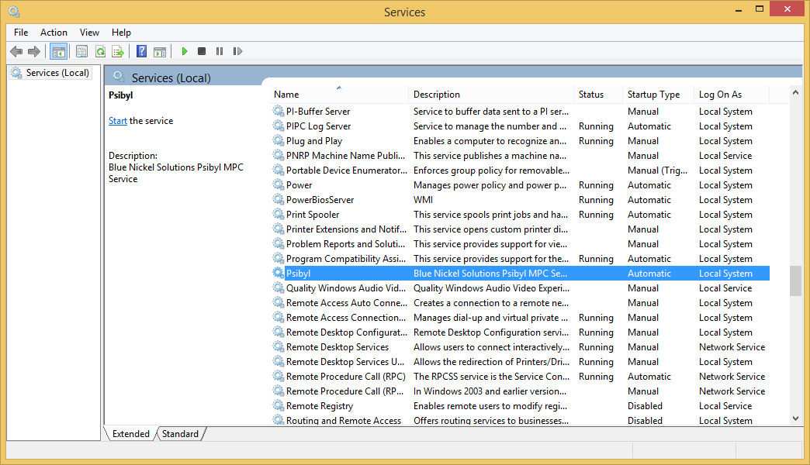

The following prerequisites are required to install Psibyl.

* Silverlight
* IIS Express
* SQL Server

## 1. Download and extract the prerequisites from here.
 

## 2. Install each of the prerequisites above seperately from the extracted prerequisites.
 

## 3. Download and install the latest version of Psibyl from here.
 

## 4. Go to the Start menu and seach for "Psibyl". Select the shortcut called "Psibyl - Config"
 

## 5. Enter in the connection details for the SQL Server. The default server for a SQL Server Express installation is ".\SQLExpress" using windows authentication.
If the database does not exist it will be created automatically for you when the Psibyl Server is started. Otherwise, the existing database will be used. If you have an old version of the Psibyl database and you wish to migrate the data to the new version, please see Psibyl DB Migration

## 6.  Press Windows Key + R and type "services.msc". Locate the service called "Psibyl" and restart it.


Make sure that the "Log On As" account has sufficient access to the SQL Server and the installation directory.
 

## 7. Browse to the Psibyl install location (default is C:\Program Files (x86)\Blue Nickel Solutions\Psibyl). Navigate to the Server\Logs and check that the database was connected to successfully.
 
```
2015-04-23 14:21:54Z [4] Information Psibyl Server 0: Log Directory is 'C:\Program Files (x86)\Blue Nickel Solutions\Psibyl\Server\Log'
2015-04-23 14:21:54Z [4] Information Psibyl Server 0: Starting Psibyl Service
2015-04-23 14:21:54Z [4] Verbose Psibyl Server 0: Starting Http Self Host Server
2015-04-23 14:21:54Z [4] Verbose Psibyl Server 0: Initializing Database
2015-04-23 14:22:01Z [4] Information Psibyl Server 0: Psibyl Service started at http://localhost:9000/
```